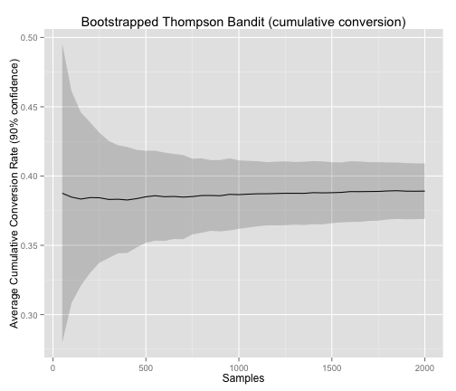
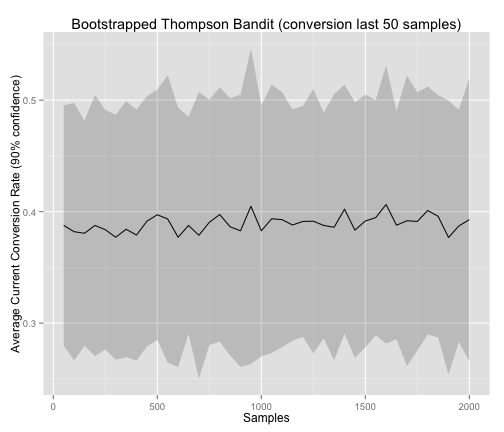
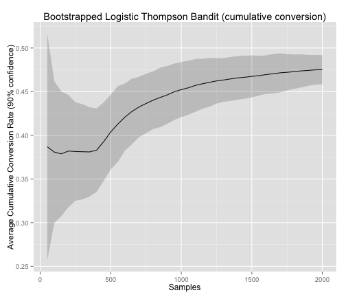
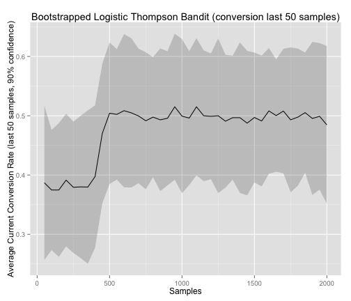

Simulating Thompson sampling with the online bootstrap
========================================================


Using method described in [Thompson sampling with the online bootstrap](http://arxiv.org/abs/1410.4009) [Eckles&Kaptein 2014], I ran a few simulations comparing a simple Thompson bandit with a contextual bandit using logistic regression using the same bootstrap.

Simulated bandit has two arms. One arm has a fixed conversion probability of 0.4, the other of either 0.15 or 0.6, depending on a single binary contextual variable. First 100 samples per arm per bootstrap are considered as warmup period and thus arms recieve uniformly random probability when less than 100 samples are in the selected bootstrap sample pool.

# Uninformed Bandit

Best uninformed strategy is to always pick the static arm, resulting in an optimum conversion rate of 0.4. The Thompson bandit almost immediately converges to this optimum.


```r
ggplot(data = at, aes(x = visitors, y = avg)) + geom_line() + geom_ribbon(aes(ymin = ymin, 
    ymax = ymax), alpha = 0.2) + ggtitle("Bootstrapped Thompson Bandit (cumulative conversion)") + 
    ylab("Average Cumulative Conversion Rate (90% confidence)") + xlab("Samples")
```

 


```r
ggplot(data = at, aes(x = visitors, y = avg)) + geom_line() + geom_ribbon(aes(ymin = ymin, 
    ymax = ymax), alpha = 0.2) + ggtitle("Bootstrapped Thompson Bandit (conversion last 50 samples)") + 
    ylab("Average Current Conversion Rate (90% confidence)") + xlab("Samples")
```

 


Perhaps the warmup period selected was too long, or the simulated differences in conversion are too strong.

# Contextual Bandit

Best informed strategy is to switch arms depending on context, resulting in an optimum conversion rate of 0.5. The Logistic Thompson bandit almost immediately converges to this optimum after the warmup period is completed (100 warmup samples x 2 because only one arm is pulled per sample x 2 because only half of samples are considered ~= 400 samples before warmup is over).


```r
ggplot(data = ac, aes(x = visitors, y = avg)) + geom_line() + geom_ribbon(aes(ymin = ymin, 
    ymax = ymax), alpha = 0.2) + ggtitle("Bootstrapped Logistic Thompson Bandit (cumulative conversion)") + 
    ylab("Average Cumulative Conversion Rate (90% confidence)") + xlab("Samples")
```

 


```r
ggplot(data = ac, aes(x = visitors, y = avg)) + geom_line() + geom_ribbon(aes(ymin = ymin, 
    ymax = ymax), alpha = 0.2) + ggtitle("Bootstrapped Logistic Thompson Bandit (conversion last 50 samples)") + 
    ylab("Average Current Conversion Rate (last 50 samples, 90% confidence)") + 
    xlab("Samples")
```

 

